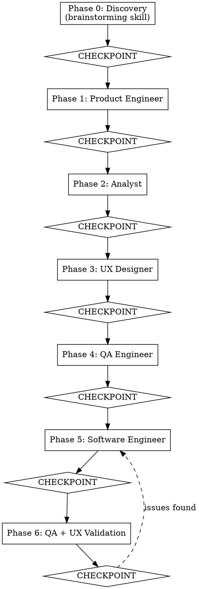

# Team Develop — Virtual IT Team Orchestration

## Overview

Assemble a virtual IT team to take a feature from idea to implementation. You are the **Team Lead** — you orchestrate, delegate, and ensure quality. You NEVER write code yourself.

The team works as a **pipeline** (default) or as a **parallel Agent Team**. In both modes, each role produces artifacts that feed into the next, and the user reviews and approves after every stage.

## When to Use

- New feature implementation requiring multiple perspectives
- Significant UI/UX redesign
- Complex refactoring with product implications
- Any task that benefits from product thinking + decomposition + UX + QA + implementation

## Mode Selection

At the start, ask the user which orchestration mode to use:

**Prompt the user:**
> "How would you like to orchestrate the team?
> 1. **Pipeline mode** — sequential subagents, each phase one at a time (default, works everywhere)
> 2. **Team mode** — Agent Teams with parallel phases and persistent teammates (experimental, requires Claude Code with `CLAUDE_CODE_EXPERIMENTAL_AGENT_TEAMS` enabled)
>
> Type 1 or 2 (default: 1):"

- If user picks **1** or just presses enter: follow **Pipeline Mode** below
- If user picks **2**: follow **Team Mode** section below
- If Team mode is selected but `TeamCreate` tool is not available, fall back to Pipeline mode and inform the user

## Team Roles

| Role | Focus | Mandatory Skill |
|------|-------|----------------|
| Product Engineer | Product value, user stories, acceptance criteria | superpowers:brainstorming |
| Analyst | Task decomposition, file paths, dependencies | superpowers:writing-plans |
| UX Designer | User experience, interaction flows, accessibility | web-design-guidelines |
| QA Engineer | Definition of Done, test scenarios | superpowers:verification-before-completion |
| Software Engineer | Implementation, TDD, commits | superpowers:test-driven-development |

## Pipeline Mode (Sequential Subagents)

> This is the default mode. If the user chose Team mode, skip to "## Team Mode" below.

### The Pipeline



### Phase 0: Discovery (REQUIRED)

**You MUST invoke the superpowers:brainstorming skill and follow it exactly.**

Process:
1. Explore the project context (files, docs, tech stack, recent commits)
2. Follow brainstorming process: ask questions one at a time, multiple-choice preferred
3. Propose 2-3 approaches with trade-offs
4. Present design in sections (200-300 words), validate each with user
5. Save validated design to `docs/plans/YYYY-MM-DD-<feature>-design.md`
6. Extract brief:
   - **Goal**: one sentence
   - **Problem statement**: what user problem this solves
   - **Affected area**: which parts of codebase
   - **Constraints**: technical, timeline, backward compatibility
   - **Success criteria**: how we know it's done

**CHECKPOINT**: Present the brief to user. Wait for approval before continuing.

### Phases 1-4: Specialist Agents

For each phase, follow this exact sequence:

#### Step 1: Read the role prompt
Read the corresponding `role-*.md` file from this skill's directory.

#### Step 2: Dispatch the agent
Use `Task` tool (subagent_type: general-purpose) with:
- The role prompt template
- The brief from Phase 0
- ALL artifacts from previous phases (full text, not file references)
- Instruction to discover and apply relevant skills (see Skill Discovery below)

#### Step 3: Receive and save output
- Save the agent's output to `docs/plans/YYYY-MM-DD-<feature>-<role>.md`
- Present a summary to the user

#### Step 4: CHECKPOINT
Show the summary. Ask user: "Approve, request changes, or skip this stage?"
- **Approve**: continue to next phase
- **Changes**: describe what to change, re-dispatch the same role
- **Skip**: mark as skipped, continue with available context

### Phase 5: Implementation

Read `role-software-engineer.md`. For EACH task from the Analyst's plan:

1. Dispatch a fresh Software Engineer subagent with:
   - The specific task description
   - Product spec + UX criteria + test plan for that task
   - Instruction to follow TDD
2. Receive implementation report
3. **CHECKPOINT** after each task: show files changed, tests written, commits made

### Phase 6: Validation

1. Dispatch QA validator (from `role-validators.md`) with:
   - Original test plan
   - Implementation report from all tasks
   - Instruction: verify DoD compliance independently, do NOT trust the engineer's report
2. Dispatch UX validator (from `role-validators.md`) with:
   - Original UX criteria
   - Implementation report
   - Instruction: verify UX compliance from user's perspective

If issues found:
- Route specific issues back to Software Engineer for fixes
- Re-validate after fixes
- Max 3 reroute cycles, then escalate to user

**CHECKPOINT**: Present final validation report.

### Skill Discovery (REQUIRED for every agent)

Every agent prompt MUST include this block:

```
Before you begin your work:
1. Search for available skills:
   - Look in ~/.claude/skills/ for SKILL.md files
   - Look in ~/.claude/plugins/**/skills/ for SKILL.md files
2. Read the name and description of each found skill
3. Apply any skill that is relevant to YOUR role
4. List which skills you applied in your report
```

### Context Accumulation Rule

Each phase receives ALL artifacts from prior phases. Never summarize — pass full text.

```
Phase 1 receives: brief + design
Phase 2 receives: brief + design + product spec
Phase 3 receives: brief + design + product spec + task plan
Phase 4 receives: brief + design + product spec + task plan + UX criteria
Phase 5 receives: per-task slice of all above
Phase 6 receives: all above + implementation reports
```

### Artifacts Produced

All saved to `docs/plans/` in the project directory:

| Phase | File |
|-------|------|
| 0 | `YYYY-MM-DD-<feature>-design.md` |
| 1 | `YYYY-MM-DD-<feature>-product-spec.md` |
| 2 | `YYYY-MM-DD-<feature>-tasks.md` |
| 3 | `YYYY-MM-DD-<feature>-ux-criteria.md` |
| 4 | `YYYY-MM-DD-<feature>-test-plan.md` |
| 6 | `YYYY-MM-DD-<feature>-validation.md` |

## Team Mode (Agent Teams)

> **Prerequisite:** The environment variable `CLAUDE_CODE_EXPERIMENTAL_AGENT_TEAMS` must be enabled. If the `TeamCreate` tool is not available, fall back to Pipeline mode and inform the user.

In Team mode, you (Team Lead) create an Agent Team and spawn persistent teammates. Unlike Pipeline mode where each agent is a fire-and-forget subagent, Team mode teammates persist across the session, communicate with each other via `SendMessage`, and coordinate via a shared task list.

**Key advantages:**
- Phases 3 (UX Designer) and 4 (QA Engineer) run in **parallel**
- Phase 6 validators run in **parallel**
- Teammates can ask each other clarifying questions directly
- Shared task list provides visibility into progress

### Team Mode: Phase 0 — Discovery

Identical to Pipeline mode. You (Team Lead) perform discovery yourself using the `superpowers:brainstorming` skill. Save the design document and extract the brief.

**CHECKPOINT**: Present the brief to user. Wait for approval before continuing.

### Team Mode: Phase 0.5 — Team Setup

After Phase 0 is approved:

1. **Create the team:**
   ```
   TeamCreate:
     team_name: "td-<feature-slug>"
     description: "Team Develop: <feature name>"
   ```

2. **You are the Team Lead.** You MUST NOT write implementation code. You coordinate, delegate, and present checkpoints. Use delegation mode.

3. **Spawn teammates** (5 teammates via `Task` tool with `team_name` parameter):

   | Teammate Name | Role File | subagent_type |
   |---------------|-----------|---------------|
   | `product-engineer` | `role-product-engineer.md` | `general-purpose` |
   | `analyst` | `role-analyst.md` | `general-purpose` |
   | `ux-designer` | `role-ux-designer.md` | `general-purpose` |
   | `qa-engineer` | `role-qa-engineer.md` | `general-purpose` |
   | `software-engineer` | `role-software-engineer.md` | `general-purpose` |

   Each teammate's initial prompt MUST include:
   - Their full role file content (read from `role-*.md`)
   - The team name for `SendMessage` coordination
   - Instruction: "Wait for task assignment from the Team Lead. Do not begin work until you receive a message with your task details."

4. **Create the task list** using `TaskCreate`:

   | Task | Subject | Blocked By |
   |------|---------|------------|
   | 1 | Phase 1: Product Specification | — |
   | 2 | Phase 2: Task Decomposition (Analyst) | 1 |
   | 3 | Phase 3: UX Criteria | 2 |
   | 4 | Phase 4: Test Plan (QA) | 2 |
   | 5 | Phase 5: Implementation | 3, 4 |
   | 6 | Phase 6: QA Validation | 5 |
   | 7 | Phase 6: UX Validation | 5 |

   Note: Tasks 3 and 4 both depend only on Task 2, enabling parallelism.
   Tasks 6 and 7 both depend only on Task 5, enabling parallel validation.

### Team Mode: Phase 1 — Product Engineer

1. Assign Task 1 to `product-engineer` via `TaskUpdate` (set owner, status=in_progress)
2. Send the brief + design document to `product-engineer` via `SendMessage`:
   - Include full text of brief and design document
   - Instruct to save output to `docs/plans/YYYY-MM-DD-<feature>-product-spec.md`
   - Instruct to mark Task 1 as completed via `TaskUpdate` and send summary back
3. Wait for `product-engineer` to complete (idle notification with task completion message)
4. Read the saved artifact file
5. **CHECKPOINT**: Present summary to user. Approve / Changes / Skip.
   - If changes: send corrections to `product-engineer` via `SendMessage`, re-wait
   - If skip: mark task as completed, note "skipped" in context

### Team Mode: Phase 2 — Analyst

1. Assign Task 2 to `analyst` via `TaskUpdate`
2. Send brief + design + product spec to `analyst` via `SendMessage`
3. Wait for completion
4. Read artifact
5. **CHECKPOINT**: Present summary. Approve / Changes / Skip.

### Team Mode: Phases 3 + 4 — UX Designer and QA Engineer (PARALLEL)

This is the key parallelism opportunity. Both roles receive the same inputs and produce independent outputs.

1. Assign Task 3 to `ux-designer` AND Task 4 to `qa-engineer` via `TaskUpdate` (both assignments in the same turn)
2. Send the accumulated context to BOTH teammates via two `SendMessage` calls in the same turn:
   - To `ux-designer`: brief + design + product spec + task plan + "Produce UX Criteria"
   - To `qa-engineer`: brief + design + product spec + task plan + "Produce Test Plan"
3. Wait for BOTH to complete (you will receive two idle notifications as each finishes)
4. Read both artifact files
5. **CHECKPOINT**: Present both summaries together. Approve / Changes / Skip (per role).
   - If changes to UX: send corrections to `ux-designer`
   - If changes to QA: send corrections to `qa-engineer`
   - Wait for revised output before continuing

### Team Mode: Phase 5 — Implementation

1. For EACH task from the Analyst's plan:
   a. Create a sub-task via `TaskCreate` (blocked by Tasks 3, 4)
   b. Assign to `software-engineer` via `TaskUpdate`
   c. Send via `SendMessage`: task description + relevant product spec + UX criteria + test plan
   d. Wait for completion
   e. **CHECKPOINT** after each task: show files changed, tests, commits
2. After all implementation tasks complete, mark Task 5 as completed

### Team Mode: Phase 6 — Validation (PARALLEL)

Spawn two additional validator teammates for fresh context:

1. Read the QA Validator and UX Validator sections from `role-validators.md`
2. Spawn `qa-validator` and `ux-validator` as new teammates via `Task` with `team_name`
3. Assign Task 6 to `qa-validator` and Task 7 to `ux-validator`
4. Send artifacts to both in parallel via `SendMessage`:
   - To `qa-validator`: test plan + all implementation reports + product spec
   - To `ux-validator`: UX criteria + all implementation reports + product spec
5. Wait for both to complete
6. If issues found:
   - Route specific issues to `software-engineer` via `SendMessage`
   - Re-validate after fixes (max 3 reroute cycles, then escalate to user)
7. **CHECKPOINT**: Present final validation report.

### Team Mode: Cleanup

After final checkpoint:

1. Send `shutdown_request` to all teammates via `SendMessage`:
   ```
   SendMessage:
     type: shutdown_request
     recipient: <teammate-name>
     content: "All phases complete. Thank you."
   ```
2. Wait for all shutdown approvals
3. Clean up the team: `TeamDelete`

### Team Mode: Context Sharing Strategy

In Team mode, context sharing uses `SendMessage` instead of prompt accumulation:

```
Phase 1: Leader sends brief + design → product-engineer
Phase 2: Leader sends brief + design + product-spec → analyst
Phase 3: Leader sends brief + design + product-spec + tasks → ux-designer  ┐ PARALLEL
Phase 4: Leader sends brief + design + product-spec + tasks → qa-engineer  ┘
Phase 5: Leader sends per-task slice → software-engineer
Phase 6: Leader sends test-plan + impl-reports → qa-validator  ┐ PARALLEL
         Leader sends ux-criteria + impl-reports → ux-validator ┘
```

**IMPORTANT:**
- Leader reads artifact files from `docs/plans/` to present checkpoints to the user
- Teammates send only summaries via `SendMessage`; Leader reads full artifacts from files
- Artifact files in `docs/plans/` remain the source of truth (identical to Pipeline mode)
- Always send full text context, never summarize

### Team Mode: Error Handling

| Situation | Action |
|-----------|--------|
| `TeamCreate` tool not available | Fall back to Pipeline mode entirely, inform user |
| Teammate goes idle without completing task | Send a follow-up message asking for status |
| Teammate crashes | Spawn a replacement teammate, re-assign the task |
| Teammate's context window fills up | Spawn a fresh software-engineer every 3-4 implementation tasks |
| Parallel phases produce conflicting output | Leader mediates at the combined checkpoint |
| Team name collision | Use `td-<feature>-<YYYYMMDD>` format |
| User rejects checkpoint | Send corrections to the specific teammate via `SendMessage` |
| Teammate asks a question | Leader relays to user, collects answer, forwards via `SendMessage` |
| Validation cycle exceeds 3 iterations | Stop rerouting. Present issues to user, ask how to proceed |

## Edge Cases

| Situation | Action |
|-----------|--------|
| User rejects checkpoint | Ask what to change. Re-dispatch same role with corrections. |
| User wants to skip a role | Allow it. Mark as skipped, continue with available context. |
| Agent asks questions | Relay to user, collect answer, resume agent. |
| Validation fails 3 times | Stop rerouting. Present issues to user, ask how to proceed. |
| No `docs/plans/` directory | Create it automatically. |
| Codebase has no tests | Software Engineer creates test infrastructure as Task 0. |

## Red Flags — STOP and Escalate to User

- You are about to write implementation code yourself
- An agent produced output that contradicts the user's approved design
- Two agents produced conflicting requirements
- Validation cycle exceeded 3 iterations
- Agent reports it cannot complete the task

## What This Skill Does NOT Do

- Does not push to git remote (asks user first)
- Does not create PRs (defers to superpowers:finishing-a-development-branch)
- Does not make architectural decisions without user approval
- Team Lead NEVER writes code — strictly delegates

## Integration

**Required skills:**
- superpowers:brainstorming — Phase 0 discovery
- superpowers:writing-plans — Phase 2 task decomposition

**Recommended skills:**
- superpowers:test-driven-development — Phase 5 implementation
- superpowers:verification-before-completion — Phase 4+6 QA
- superpowers:systematic-debugging — Phase 5 if issues arise
- superpowers:using-git-worktrees — isolated workspace setup
- superpowers:finishing-a-development-branch — after Phase 6
- web-design-guidelines — Phase 3 UX validation
