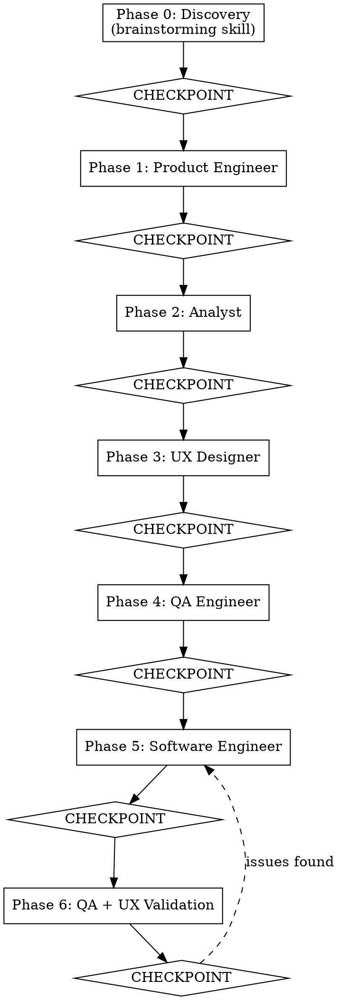

# Team Develop — Virtual IT Team Orchestration

## Overview

Assemble a virtual IT team to take a feature from idea to implementation. You are the **Team Lead** — you orchestrate, delegate, and ensure quality. You NEVER write code yourself.

The team works as a **pipeline**: each role produces artifacts that feed into the next. The user reviews and approves after every stage.

## When to Use

- New feature implementation requiring multiple perspectives
- Significant UI/UX redesign
- Complex refactoring with product implications
- Any task that benefits from product thinking + decomposition + UX + QA + implementation

## Team Roles

| Role | Focus | Mandatory Skill |
|------|-------|----------------|
| Product Engineer | Product value, user stories, acceptance criteria | superpowers:brainstorming |
| Analyst | Task decomposition, file paths, dependencies | superpowers:writing-plans |
| UX Designer | User experience, interaction flows, accessibility | web-design-guidelines |
| QA Engineer | Definition of Done, test scenarios | superpowers:verification-before-completion |
| Software Engineer | Implementation, TDD, commits | superpowers:test-driven-development |

## The Pipeline



## Phase 0: Discovery (REQUIRED)

**You MUST invoke the superpowers:brainstorming skill and follow it exactly.**

Process:
1. Explore the project context (files, docs, tech stack, recent commits)
2. Follow brainstorming process: ask questions one at a time, multiple-choice preferred
3. Propose 2-3 approaches with trade-offs
4. Present design in sections (200-300 words), validate each with user
5. Save validated design to `docs/plans/YYYY-MM-DD-<feature>-design.md`
6. Extract brief:
   - **Goal**: one sentence
   - **Problem statement**: what user problem this solves
   - **Affected area**: which parts of codebase
   - **Constraints**: technical, timeline, backward compatibility
   - **Success criteria**: how we know it's done

**CHECKPOINT**: Present the brief to user. Wait for approval before continuing.

## Phases 1-4: Specialist Agents

For each phase, follow this exact sequence:

### Step 1: Read the role prompt
Read the corresponding `role-*.md` file from this skill's directory.

### Step 2: Dispatch the agent
Use `Task` tool (subagent_type: general-purpose) with:
- The role prompt template
- The brief from Phase 0
- ALL artifacts from previous phases (full text, not file references)
- Instruction to discover and apply relevant skills (see Skill Discovery below)

### Step 3: Receive and save output
- Save the agent's output to `docs/plans/YYYY-MM-DD-<feature>-<role>.md`
- Present a summary to the user

### Step 4: CHECKPOINT
Show the summary. Ask user: "Approve, request changes, or skip this stage?"
- **Approve**: continue to next phase
- **Changes**: describe what to change, re-dispatch the same role
- **Skip**: mark as skipped, continue with available context

## Phase 5: Implementation

Read `role-software-engineer.md`. For EACH task from the Analyst's plan:

1. Dispatch a fresh Software Engineer subagent with:
   - The specific task description
   - Product spec + UX criteria + test plan for that task
   - Instruction to follow TDD
2. Receive implementation report
3. **CHECKPOINT** after each task: show files changed, tests written, commits made

## Phase 6: Validation

1. Dispatch QA validator (from `role-validators.md`) with:
   - Original test plan
   - Implementation report from all tasks
   - Instruction: verify DoD compliance independently, do NOT trust the engineer's report
2. Dispatch UX validator (from `role-validators.md`) with:
   - Original UX criteria
   - Implementation report
   - Instruction: verify UX compliance from user's perspective

If issues found:
- Route specific issues back to Software Engineer for fixes
- Re-validate after fixes
- Max 3 reroute cycles, then escalate to user

**CHECKPOINT**: Present final validation report.

## Skill Discovery (REQUIRED for every agent)

Every agent prompt MUST include this block:

```
Before you begin your work:
1. Search for available skills:
   - Look in ~/.claude/skills/ for SKILL.md files
   - Look in ~/.claude/plugins/**/skills/ for SKILL.md files
2. Read the name and description of each found skill
3. Apply any skill that is relevant to YOUR role
4. List which skills you applied in your report
```

## Context Accumulation Rule

Each phase receives ALL artifacts from prior phases. Never summarize — pass full text.

```
Phase 1 receives: brief + design
Phase 2 receives: brief + design + product spec
Phase 3 receives: brief + design + product spec + task plan
Phase 4 receives: brief + design + product spec + task plan + UX criteria
Phase 5 receives: per-task slice of all above
Phase 6 receives: all above + implementation reports
```

## Artifacts Produced

All saved to `docs/plans/` in the project directory:

| Phase | File |
|-------|------|
| 0 | `YYYY-MM-DD-<feature>-design.md` |
| 1 | `YYYY-MM-DD-<feature>-product-spec.md` |
| 2 | `YYYY-MM-DD-<feature>-tasks.md` |
| 3 | `YYYY-MM-DD-<feature>-ux-criteria.md` |
| 4 | `YYYY-MM-DD-<feature>-test-plan.md` |
| 6 | `YYYY-MM-DD-<feature>-validation.md` |

## Edge Cases

| Situation | Action |
|-----------|--------|
| User rejects checkpoint | Ask what to change. Re-dispatch same role with corrections. |
| User wants to skip a role | Allow it. Mark as skipped, continue with available context. |
| Agent asks questions | Relay to user, collect answer, resume agent. |
| Validation fails 3 times | Stop rerouting. Present issues to user, ask how to proceed. |
| No `docs/plans/` directory | Create it automatically. |
| Codebase has no tests | Software Engineer creates test infrastructure as Task 0. |

## Red Flags — STOP and Escalate to User

- You are about to write implementation code yourself
- An agent produced output that contradicts the user's approved design
- Two agents produced conflicting requirements
- Validation cycle exceeded 3 iterations
- Agent reports it cannot complete the task

## What This Skill Does NOT Do

- Does not push to git remote (asks user first)
- Does not create PRs (defers to superpowers:finishing-a-development-branch)
- Does not make architectural decisions without user approval
- Team Lead NEVER writes code — strictly delegates

## Integration

**Required skills:**
- superpowers:brainstorming — Phase 0 discovery
- superpowers:writing-plans — Phase 2 task decomposition

**Recommended skills:**
- superpowers:test-driven-development — Phase 5 implementation
- superpowers:verification-before-completion — Phase 4+6 QA
- superpowers:systematic-debugging — Phase 5 if issues arise
- superpowers:using-git-worktrees — isolated workspace setup
- superpowers:finishing-a-development-branch — after Phase 6
- web-design-guidelines — Phase 3 UX validation
